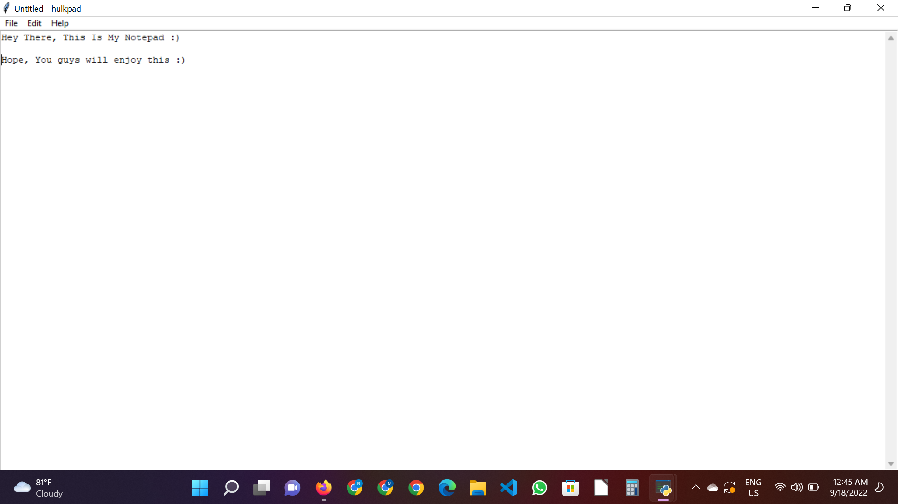
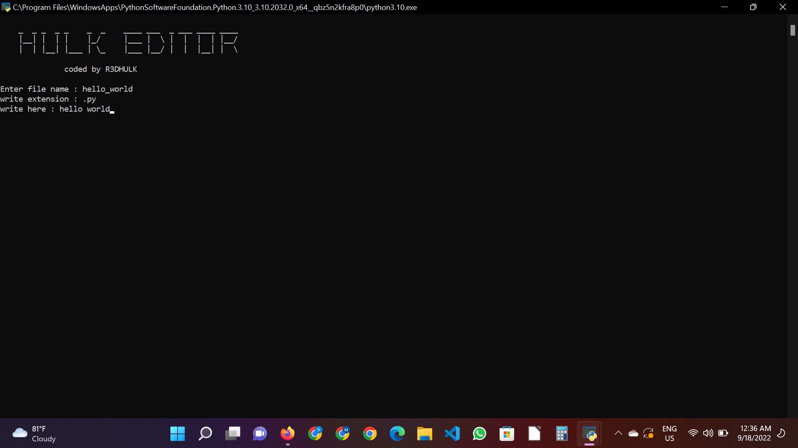
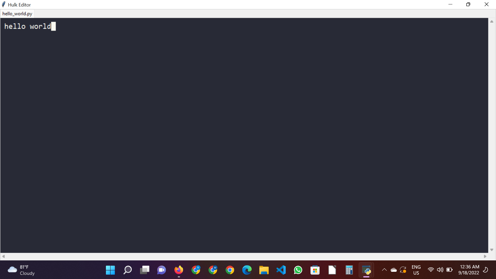
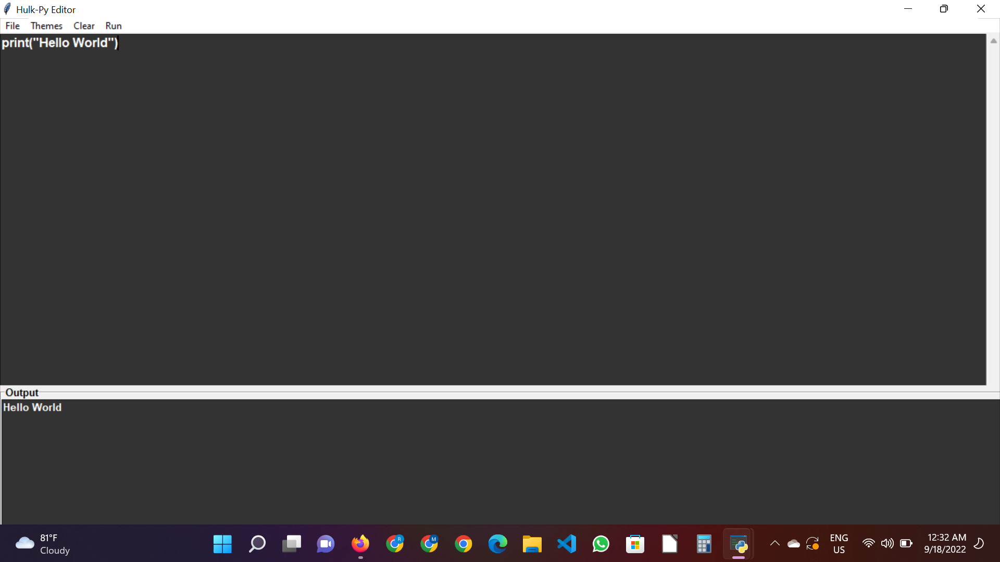
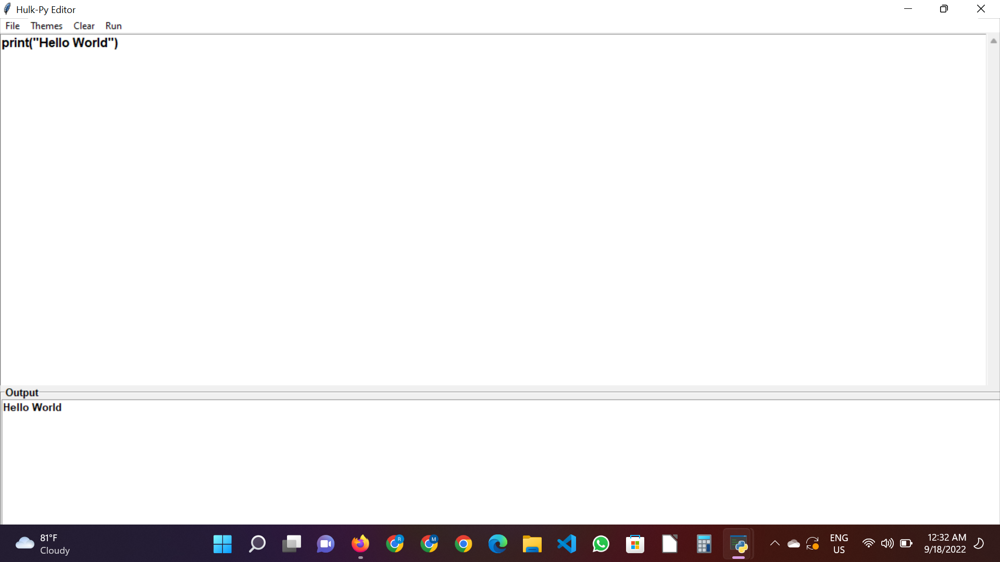

# R3DHULK'S CODE EDITOR
## all in one code ide solution

## hulkpad is a alternative of notepad
## hulk-editor is a gui output of cmd python script and also it is a better writingpad
## hulkpy-editor is my first try of a python ide, it's quiet good
## hulkpy-editor(mark-2) is better and also provides you two theme to work without eye-problem
## Highlighted
Modified By R3DHULK
# Installation
installation process : git clone https://github.com/R3DHULK/r3dhulk-s-code_editor.git
# Output : 
## hulkpad's output : 

## hulk-editor's ui interface's output : 

## hulk-editor's result interface's output : 

## hulkpy-editor's result output : 

## hulkpy-editor(mark-2)'s result output (dark mode):

## hulkpy-editor(mark-2)'s result output (light mode):
